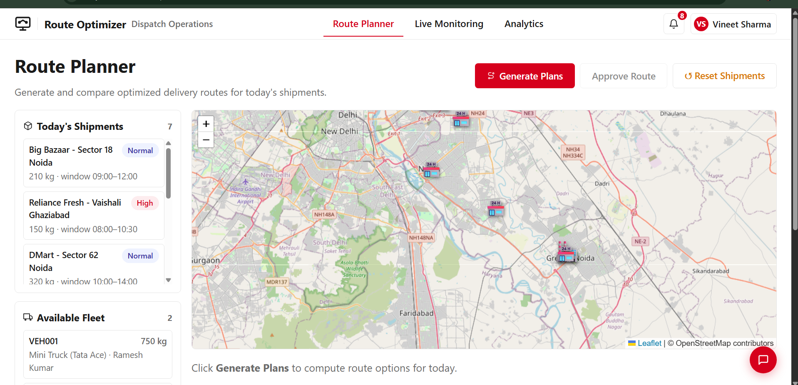
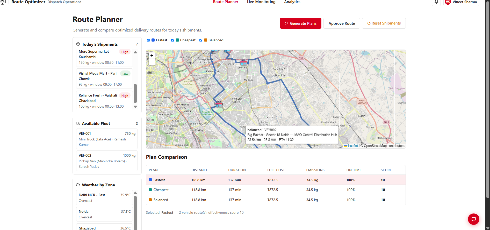
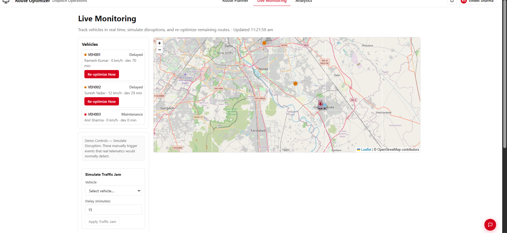
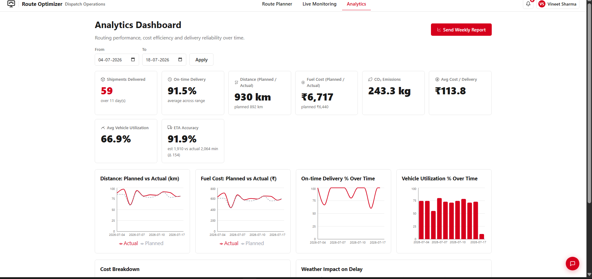
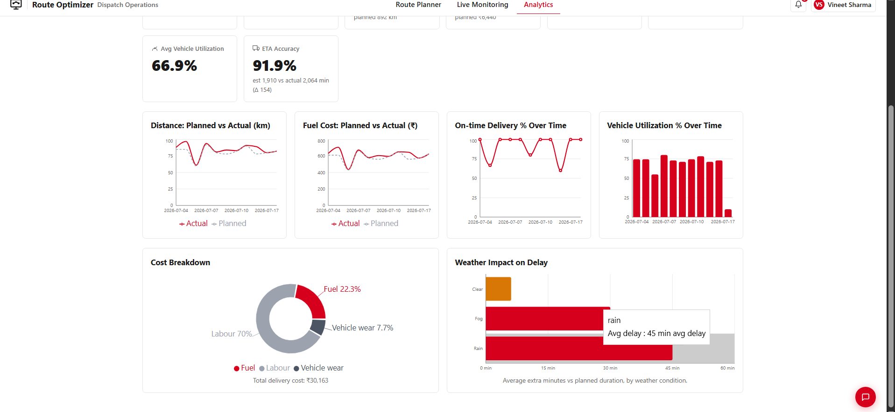
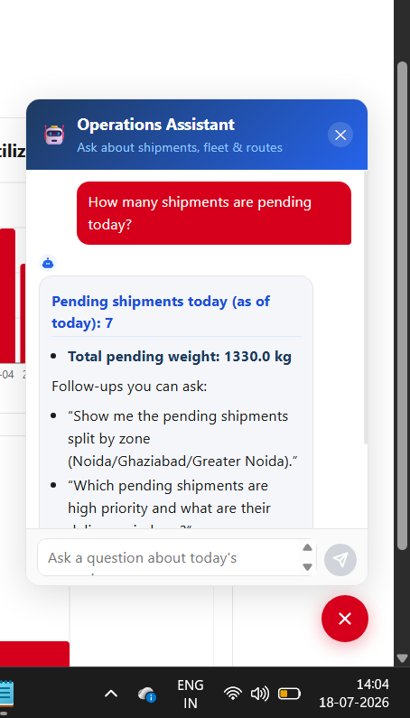
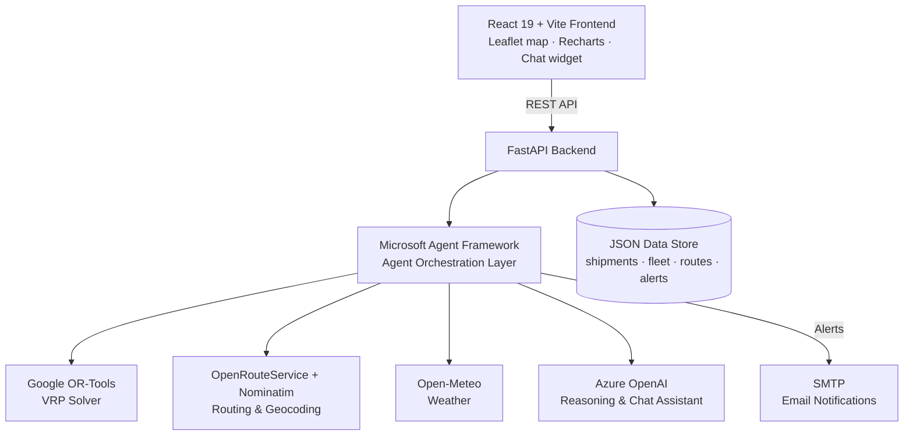

# 🚚 Route Optimizer — Agentic AI for Warehouse Delivery Operations


[](https://roa-yzbe.onrender.com/login)

**An agentic AI system that plans, monitors, and explains delivery routes for a
warehouse shipping to multiple retail stores** — combining constraint-based
optimization (Google OR-Tools) with an LLM agent layer (Microsoft Agent
Framework + Azure OpenAI) for planning, disruption response, analytics, and
natural-language querying.

Built end-to-end: routing engine, live fleet map, KPI dashboard, automated
alerting, and a conversational assistant — all in one dispatch console.

**🔗 Live Demo:** [roa-yzbe.onrender.com](https://roa-yzbe.onrender.com/login)
*(hosted on Render's free tier — the backend may take ~30–60s to wake up on
first load)*

---

## 📋 Table of Contents
- [Overview](#-overview)
- [Screenshots](#-screenshots)
- [Key Features](#-key-features)
- [Architecture](#-architecture)
- [Tech Stack](#-tech-stack)
- [Sample Results](#-sample-results-demo-dataset)
- [What This Project Demonstrates](#-what-this-project-demonstrates)
- [Quick Start](#-quick-start)
- [Deployment](#️-deployment-render)
- [Roadmap](#-roadmap)
- [Author](#-author)

---

## 📌 Overview

Warehouse dispatch teams plan delivery routes to dozens of stores every day —
balancing vehicle capacity, delivery time windows, fuel cost, and traffic, then
re-planning by hand whenever something goes wrong (a delay, a breakdown, an
urgent order). **Route Optimizer** automates this end to end:

1. **Plan** — generates and compares Fastest / Cheapest / Balanced route
   options using a real vehicle-routing solver.
2. **Monitor** — tracks the fleet, detects disruptions, and re-optimizes only
   the affected portion of a route.
3. **Analyze** — surfaces planned-vs-actual performance, cost breakdowns, and
   weather-correlated delay trends.
4. **Ask** — lets a dispatcher or executive query any of the above in plain
   English, grounded strictly in live data.

---

## 🖼 Screenshots

### Route Planner — generate and compare optimized plans
Shipment intake, live fleet, and an interactive map with per-leg hover detail
(distance, duration, ETA) for every route segment.




### Live Monitoring — disruption simulation and re-optimization
Tracks vehicle status and ETA deviation, with one-click disruption simulation
(traffic jam, breakdown) and a re-optimize action scoped to the affected vehicle.



### Analytics Dashboard — routing performance over time
Planned-vs-actual trends, cost breakdown, and weather-correlated delay
analysis, with a one-click emailed weekly report.




### Operations Assistant — conversational data queries
A floating chat assistant that answers questions about shipments, fleet, and
routes, grounded in live data, with suggested follow-ups.



---

## ✨ Key Features

**🧠 AI-Driven Route Planning**
Generates and compares *Fastest*, *Cheapest*, and *Balanced* route plans via a
Vehicle Routing Problem (VRP) solver, each scored on distance, duration, fuel
cost, and emissions.

**📍 Real-Time Fleet Monitoring & Disruption Response**
A live interactive map (Leaflet) tracks vehicle location, speed, and ETA
deviation. Disruptions can be simulated (traffic jam, breakdown) to trigger
targeted re-optimization of only the affected route segment — not a full
daily re-plan.

**🌦️ Dynamic Weather Integration**
Live weather per delivery zone feeds into ETA estimation and is analyzed
against historical delay data (e.g., rain days average measurably higher
delay than clear days — see Analytics).

**🚨 Proactive Alerting**
Automated email + in-app dashboard alerts for ETA deviations, breakdowns, and
weekly performance summaries.

**📊 Analytics & KPI Dashboard**
Planned-vs-actual tracking for distance, fuel cost, on-time delivery, and
vehicle utilization, plus a fuel/labour/vehicle-wear cost breakdown and
weather-delay correlation.

**💬 Conversational Operations Assistant**
A chat interface for free-text questions about today's shipments, fleet, and
routes. Answers are grounded strictly in tool-retrieved data — the assistant
is read-only by design, so it can explain and inform but never approve a
route or trigger an action on its own.

---

## 🏗️ Architecture



The frontend never talks to OR-Tools, routing, or weather providers directly —
every data-touching operation goes through the FastAPI backend and is
orchestrated by MAF agent tools, keeping the optimization logic, external API
calls, and grounding rules for the chat assistant centralized in one place.

---

## 🧰 Tech Stack

| Layer | Technology |
|---|---|
| Frontend | React 19, Vite, React-Leaflet, Recharts |
| Backend | FastAPI (Python 3.10+) |
| Agent Orchestration | Microsoft Agent Framework |
| LLM Reasoning | Azure OpenAI |
| Optimization Engine | Google OR-Tools (Vehicle Routing Problem solver) |
| Routing & Geocoding | OpenRouteService, Nominatim |
| Weather | Open-Meteo |
| Alerting | SMTP (email) + in-app dashboard |
| Deployment | Render (Blueprint: Web Service + Static Site) |

---

## 📊 Sample Results (Demo Dataset)

Figures below are live output from the Analytics Dashboard over an 11-day demo
window — not projected estimates:

| Metric | Value |
|---|---|
| Shipments Delivered | 59 |
| On-time Delivery Rate | 91.5% |
| ETA Accuracy (estimated vs. actual duration) | 91.9% |
| Distance — Planned vs. Actual | 892 km → 930 km |
| Fuel Cost — Planned vs. Actual | ₹6,440 → ₹6,717 |
| CO₂ Emissions | 243.3 kg |
| Avg. Cost per Delivery | ₹113.8 |
| Avg. Vehicle Utilization | 66.9% |

**Target outcomes at production scale**, based on the efficiency gains this
class of routing optimization typically delivers:
- Meaningful reduction in fuel consumption and vehicle wear through
  better-planned routes
- Improved SLA compliance via proactive delay detection and targeted
  re-optimization
- Reduced manual dispatch planning time
- Lower carbon footprint, supporting ESG reporting goals

---

## 🎯 What This Project Demonstrates

- **Full-stack product development** — React/Vite frontend, FastAPI backend,
  deployed and running end to end.
- **Applied operations research** — modeling a real Capacitated VRP with Time
  Windows and translating solver output into decision-ready comparisons.
- **Agentic AI system design** — tool-grounded LLM agents with explicit
  guardrails (read-only chat agent, no-unsourced-numbers rule) rather than an
  open-ended chatbot.
- **Third-party API integration** — routing, geocoding, and weather providers
  composed into a single planning pipeline.
- **Operational UX** — dashboards and alerting designed for how a dispatch
  manager actually works, not just a technical demo.

---

## 🚀 Quick Start

### Prerequisites
- Node.js (v18+)
- Python (v3.10+)
- API keys: Azure OpenAI, OpenRouteService

### 1. Backend Setup
```bash
cd backend
python -m venv .venv
# Activate virtual environment
# Windows: .venv\Scripts\activate
# Mac/Linux: source .venv/bin/activate

pip install -r requirements.txt
```

Create a `.env` file in `backend/` based on `.env.example`:
```env
OPEN_ROUTER_API_KEY=your_key_here
AZURE_OPEN_AI_KEY=your_key_here
AZURE_OPEN_AI_ENDPOINT=https://your-endpoint.openai.azure.com/
DEPLOYEMENT_NAME=your_model_deployment
SMTP_HOST=smtp.gmail.com
SMTP_PORT=587
SMTP_USER=your_email@gmail.com
SMTP_PASS=your_app_password
```

Start the API:
```bash
uvicorn app.main:app --host 0.0.0.0 --port 8000 --reload
```

### 2. Frontend Setup
```bash
cd frontend/route-optimization
npm install
npm run dev
```
The dashboard will be available at `http://localhost:5173`.

---

## ☁️ Deployment (Render)

**Live instance:** [https://roa-yzbe.onrender.com/login](https://roa-yzbe.onrender.com/login)

This project is configured for one-click deployment on
[Render](https://render.com) via the provided `render.yaml` Blueprint.

1. Push this repository to GitHub.
2. In the Render Dashboard, click **New Blueprint Instance**.
3. Connect your repository. Render provisions:
   - A **Web Service** for the FastAPI backend.
   - A **Static Site** for the React frontend.
4. Add your environment variables (from `.env`) to the backend service in the
   Render dashboard.

---

## 🗺 Roadmap

- Replace simulated GPS in Live Monitoring with a real telematics feed
  (e.g., Traccar) — the rest of the system already treats vehicle position as
  a data source, so this is a swap, not a redesign.
- Multi-warehouse support.
- Driver-facing mobile view for route acknowledgment and delivery confirmation.

---

## 👤 Author

**Shashwat Kr. Gupta (Sanji)**
Associate Software Engineer, MAQ Software — Agentic AI & Generative AI
application development.

This is an independent project built to explore agentic AI system design for
logistics/supply-chain operations; it is not an official MAQ Software product.

[](https://www.linkedin.com/in/shashwatkrgupta/)
[](https://my-portfolio-phi-three-13.vercel.app/)

---

## 📄 License

MIT — see [LICENSE](LICENSE) for details.